# dfredeem

TUI tự động nhập redeem code cho **Delta Force (Garena)**. Dùng chính tài khoản của bạn, login tay trong browser thật, script lo phần nhập code và ghi kết quả.


## Tính năng

- Dashboard live (Rich): thống kê theo trạng thái, bảng kết quả cuộn, progress bar, ETA, đếm ngược cooldown.
- Tự tìm và mở Brave / Chrome / Edge ở chế độ debug bằng profile riêng. Không cần đóng browser đang dùng, không dùng Chromium bundled của Playwright nên không dính cờ automation.
- Chờ bạn login xong rồi mới chạy (check đúng host của trang redeem, sau đó xác nhận bằng Enter).
- Đọc kết quả từ response API của trang (field `code`), không phụ thuộc vào toast trên giao diện.
- Bỏ qua nhanh code đã dùng / sai / hết hạn (nghỉ ngắn), chỉ nghỉ lâu sau code thành công.
- Resume: chạy lại tự bỏ qua code đã có kết quả cuối.
- Pause khi gặp captcha, backoff khi bị rate limit, tự dừng để bảo vệ tài khoản.
- Nhiều tài khoản: mỗi `--profile` là một browser profile riêng.

## Yêu cầu

- Python 3.8+
- Một browser Chromium đã cài: Brave, Chrome hoặc Edge
- Windows, macOS hoặc Linux

```
pip install playwright rich
```

Không cần `playwright install`, script dùng browser có sẵn trên máy.

## Cách dùng nhanh

1. Tạo `codes.txt` cùng thư mục với script, mỗi dòng một code.
2. Chạy:

   ```
   python dfredeem.py
   ```

3. Browser tự mở trang redeem. Login Garena trong cửa sổ đó.
4. Khi script thấy ô nhập code, terminal hiện: `Thấy trang nhập code rồi... nhấn ENTER`. Kiểm tra đã login đúng rồi nhấn Enter.


5. TUI chạy. Kết quả ghi vào `results.csv`.

Lần sau login vẫn còn (profile được lưu), chạy lại là vào thẳng.

## Phím tắt

| Phím | Tác dụng |
|------|----------|
| `SPACE` | Pause / resume (cũng dùng để chạy tiếp sau khi giải captcha) |
| `S` | Bỏ qua thời gian chờ hiện tại (cooldown, nghỉ giữa code) |
| `Q` | Thoát |

## Tùy chọn

| Option | Mặc định | Mô tả |
|--------|----------|-------|
| `--codes` | `codes.txt` | File chứa code, mỗi dòng một code. Tự loại trùng |
| `--profile` | `main` | Tên profile browser, lưu ở `~/.dfredeem/<profile>` |
| `--url` | trang redeem mặc định | URL trang redeem (dùng URL gốc, không cần token callback) |
| `--input` | auto | CSS selector ô nhập code |
| `--submit` | auto | CSS selector nút submit |
| `--result` | `.toast, .modal, ...` | Selector fallback đọc thông báo khi không bắt được response API |
| `--delay` | `4,8` | min,max giây nghỉ sau code **thành công** hoặc lỗi chưa rõ |
| `--fast-delay` | `1,2` | min,max giây nghỉ sau code `USED / INVALID / EXPIRED` |
| `--timeout` | `10` | Giây chờ response sau khi submit |
| `--reload` | tắt | Reload trang sau mỗi code |
| `--out` | `results.csv` | File kết quả |
| `--exe` | auto | Đường dẫn browser Chromium (Brave, Edge...) nếu không tự tìm thấy |
| `--port` | `9222` | Cổng debug của browser |

Ví dụ:

```
# nghỉ nhanh hơn khi gặp code đã dùng
python dfredeem.py --fast-delay 0.5,1

# tài khoản thứ hai, browser riêng
python dfredeem.py --profile acc2 --port 9223 --out results_acc2.csv

# browser ở đường dẫn lạ
python dfredeem.py --exe "D:\Apps\Brave\brave.exe"

# chỉ định selector thủ công
python dfredeem.py --input "#cdkey" --submit "div.btn-redeem"
```

## Trạng thái kết quả

| Trạng thái | Ý nghĩa | Lưu khi resume |
|------------|---------|----------------|
| `SUCCESS` | API trả `code: 0` | Bỏ qua lần sau |
| `USED` | Code đã dùng, hoặc tài khoản đã đạt giới hạn redeem của nhóm code (vd `code: 400067`) | Bỏ qua lần sau |
| `INVALID` | Code sai / không tồn tại | Bỏ qua lần sau |
| `EXPIRED` | Code hết hạn | Bỏ qua lần sau |
| `CAPTCHA` | Trang yêu cầu captcha | Thử lại |
| `RATELIMIT` | Bị giới hạn tần suất | Thử lại |
| `UNKNOWN` | Có response nhưng chưa khớp rule nào | Thử lại |
| `NO_RESPONSE` | Không thấy request/response nào | Thử lại |

Nếu API trả `code` khác 0 thì không bao giờ được xếp `SUCCESS`, dù message có chữ "success".

Muốn thêm keyword phân loại thì sửa danh sách `RULES` ở đầu `dfredeem.py`.

## File sinh ra

- `results.csv`: cột `time, code, status, message, profile`. Ghi ngay sau mỗi code.
- `debug.log`: mọi response XHR/fetch đã bắt được (URL, status, body), và danh sách phần tử bấm được nếu không tìm thấy nút submit.
- `~/.dfredeem/<profile>/`: dữ liệu browser (cookie, phiên đăng nhập).

## Cơ chế bảo vệ tài khoản

- **Captcha**: script pause, bạn giải tay trong browser rồi nhấn `SPACE`, script thử lại đúng code đó. Script không cố vượt captcha.
- **Rate limit**: nghỉ 45s, 90s, 180s... (tối đa 600s). Sau 5 lần liên tiếp thì dừng hẳn.
- **Không đọc được kết quả**: 2 lần liên tiếp `NO_RESPONSE` hoặc `UNKNOWN` thì tự pause để bạn kiểm tra, không đốt hết danh sách code.
- Sau mỗi code script tự đóng popup kết quả để không chặn code kế tiếp.

## Xử lý sự cố

**Login bị treo (nút Login Now xám, trang mờ)**
Thường do Brave Shields chặn script/cookie của Garena. Bấm icon sư tử trên thanh địa chỉ, tắt Shields cho `garena.com` và `redeem.df.garena.sg`. Chỉ cần làm một lần vì profile được lưu. Nếu vẫn treo thì lỗi nằm ở phía Garena (IP/VPN, risk control, cần xác minh thêm).

**Hàng loạt `NO_RESPONSE`, message ghi "không thấy nút"**
Script không tìm thấy nút submit. Mở `debug.log`, xem mục `CLICKABLES` để biết các phần tử bấm được, hoặc F12 chuột phải vào nút, Copy, Copy selector rồi chạy với `--submit "<selector>"`. Tương tự với ô nhập: `--input "<selector>"`.

**Nhiều `UNKNOWN`**
API trả message chưa có trong `RULES`. Xem cột message hoặc `debug.log`, thêm keyword tương ứng vào `RULES`.

**Không tìm thấy browser**
Dùng `--exe "<đường dẫn tới brave.exe / chrome.exe / msedge.exe>"`.

**Cổng 9222 đang bị chiếm**
Đổi cổng: `--port 9333`. Nếu đã có browser mở sẵn trên cổng đó, script sẽ gắn vào browser đó thay vì mở mới.

**Muốn chạy lại toàn bộ**
Xóa `results.csv`.

## Lưu ý

- Chỉ dùng với tài khoản và code của chính bạn.
- Không chia sẻ URL có tham số `code=` / `state=` (đó là token đăng nhập callback). Script không cần chúng, chỉ cần URL gốc.
- Tự động hóa có thể vi phạm điều khoản của dịch vụ, rủi ro khóa tài khoản do bạn tự chịu. Đừng hạ delay quá thấp.
- Cấu trúc trang và API của Garena có thể thay đổi, khi đó cần chỉnh selector hoặc `RULES`.